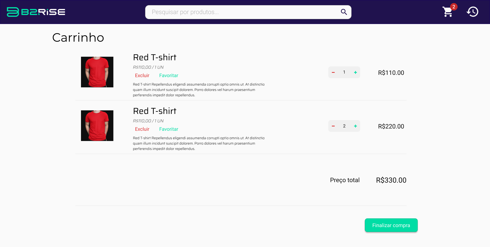

# 🚀 Frontend challenge

Bem-vindo(a) ao desafio frontend!

O objetivo deste desafio é avaliar suas habilidades de programação.
Quando sua solução estiver pronta, basta responder o e-mail que recebeu com o link do seu repo aqui no Github!
Em seguida, enviaremos o feedback e as instruções dos próximos passos!

Caso tenha alguma dúvida, nós estamos disponíveis no email *recrutamento@b2rise.consulting*.
Bom desafio!

> ⚠️ **É importante que o seu repo seja público, caso contrário não iremos conseguir avaliar sua resposta. Se você preferir, pode criar um repositório privado com acesso para o usuário** `mlucascardoso` e `notelho`.

# 🧠 Contexto

O desafio será implementar um e-commerce para venda de camisetas que deverá ter as seguintes funcionalidades:
- [ ] Listagem dos produtos
- [ ] Adicionar e remover produtos do carrinho
- [ ] Finalizar compra

Também seria muito legal se você também implementasse:
- [ ] Histórico de pedidos
- [ ] Busca por nome do produto

## 📋 Instruções

Chegou a hora de colocar a mão na massa!
- Siga [esse protótipo](https://www.figma.com/proto/SQHTonDPYDbpkxncjDfTbK/Frontend-challange)
- Utilize HTML, CSS e javascript
- Utilize o framework que você tem mais familiaridade (Angular, React, Vue, etc)
- Local storage para salvar o histórico de pedidos
- Por favor, inclua no README as instruções de instalação do projeto (se necessário)
- Sinta-se livre para incluir quaisquer observações (elas são muito bem vindas)
- Consuma os dados dos produtos que estão no arquivo **api/products.json** (você pode criar um [JSON server](https://www.npmjs.com/package/json-server) ou mockar no código)

## ✔️ Critérios de Avaliação
Além dos requisitos levantados acima, iremos olhar para os seguintes critérios durante a correção do desafio:
- Preocupação com UI (layout da tela, grid, padronização nos botões, etc)
- Preocupação com UX (feedback ao usuário, tratamentos de erro, navegação coerente, etc)
- Preocupação com código (organização dos arquivos, código limpo, GOF, SOLID, etc)
- Componentização
- Padrão de commits [Conventional](https://www.conventionalcommits.org/en/v1.0.0/)

## ❌ Não é necessário fazer tudo
O protótipo contém uma funcionalidade inteira. Não precisa fazer tudo se não conseguir, apenas o que for feito será avaliado. Foque principalmente 
em deixar as funcionalidades funcionando e o código bem bacana! 😋

## 😎 Seria legal
- Npm, Yarn
- Typescript
- Sass, Styled components, Less
- Angular, React ou Vue
- Boostrap, Bulma, Materialize
- Testes unitários
- Testes e2e

---

_O desafio acima foi cuidadosamente construído para propósitos de avaliação apenas. Já possuímos uma funcionalidade similar na nossa plataforma._
